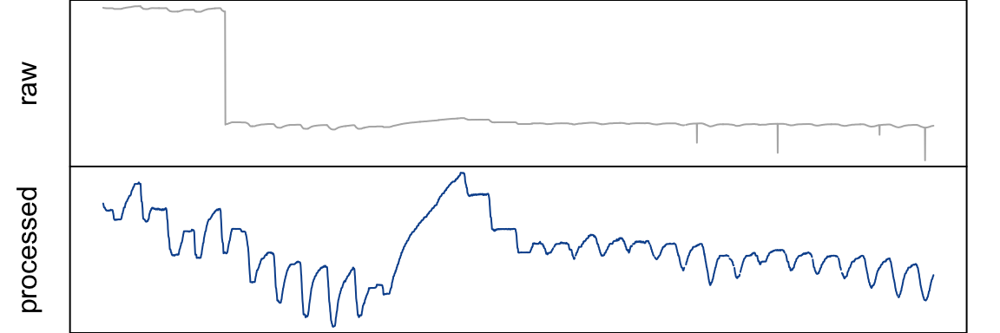

<!-- README.md is generated from README.Rmd. Please edit that file -->

# treenetproc

<!-- badges: start -->
<!-- badges: end -->

The package `treenetproc` cleans, processes and visualises highly
resolved time series of dendrometer data. In two steps, raw dendrometer
data is aligned to regular time intervals and cleaned.

Further, the package offers functions to extract the day of the year of
the start and end of the growing season as well as several
characteristics of shrinkage and expansion phases.

## Installation

You can install the latest stable version of the package from
[GitHub](https://github.com/) with:

``` r
# install.packages("devtools")
library(devtools)
devtools::install_github("akronix/treenetproc")
```

<br>

## Example

Below you can see a basic example of a processing result.

 <br>

For sample code and a demonstration of an exemplary workflow, see the
vignette ‘Introduction to treenetproc’:

``` r
browseVignettes("treenetproc")
```

If you want to access the vignettes you need to build them when
installing the package:

``` r
# install.packages("devtools")
library(devtools)
devtools::install_github("treenet/treenetproc", build_vignettes = TRUE)
```

<br>

## Citation

To cite `treenetproc` in a publication use:

``` r
citation("treenetproc")
#> 
#> To cite treenetproc in publications use:
#> 
#>   Knüsel S., Peters R.L., Haeni M., Wilhelm M., Zweifel R. 2021.
#>   Processing and extraction of seasonal tree physiological parameters
#>   from stem radius time series. Forests: 12(6): 765.
#>   https://doi.org/10.3390/f12060765.
#> 
#>   Haeni M., Knüsel S., Wilhelm M., Peters R.L., Zweifel R. 2020.
#>   treenetproc - Clean, process and visualise dendrometer data. R
#>   package version 0.1.4. Github repository:
#>   https://github.com/treenet/treenetproc
#> 
#>   Hadley Wickham, Romain François, Lionel Henry and Kirill Müller
#>   (2019). dplyr: A Grammar of Data Manipulation. R package version
#>   0.8.3. https://CRAN.R-project.org/package=dplyr
#> 
#> To see these entries in BibTeX format, use 'print(<citation>,
#> bibtex=TRUE)', 'toBibtex(.)', or set
#> 'options(citation.bibtex.max=999)'.
```
