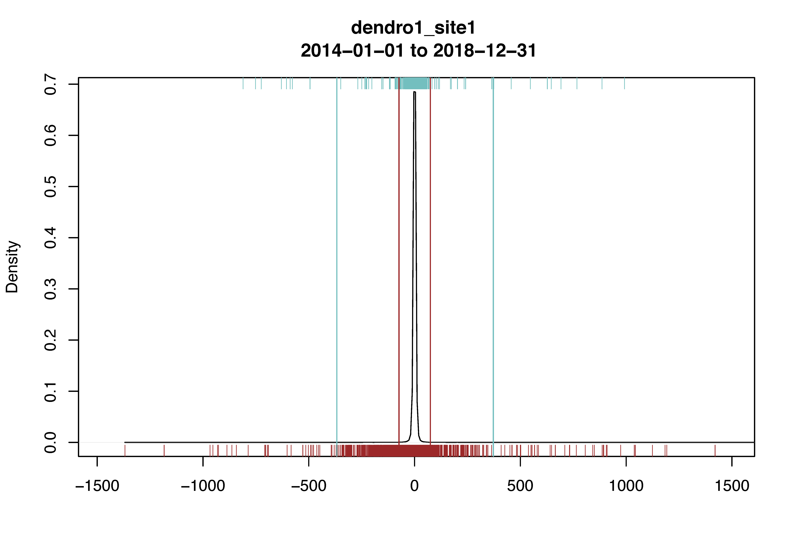

```{r, include = FALSE}
knitr::opts_chunk$set(
  collapse = TRUE,
  comment = "#>",
  fig.asp = 0.618,
  out.widht = "70%",
  eval.after = "fig.cap"
)
```

This vignette is under development. More content follows...
<br>

```{r setup}
library(treenetproc)
```


# Time-alignment (L1)
For the time-alignment a linear interpolation between the two closest
measurement points is perfomed (Figure 1). If the measurements were already
taken at regular time intervals, the measurements corresponding to the time 
interval specified in `reso` are selected.

The linear interpolation is restricted to gaps that are smaller than 
`2.1 * reso`. That is, if `reso = 10` and there is no data for more than
`21 minutes`, the timesteps in-between are set to `NA`.


```{r Figure 1, fig.asp = 0.7, fig.retina = 2, fig.cap = cap, echo = FALSE}
data("dendro_data_L0")
data("dendro_data_L1")

start <- as.POSIXct("2013-05-01 10:00:00", format = "%Y-%m-%d %H:%M:%S", 
                    tz = "UTC")
end <- as.POSIXct("2013-05-01 16:00:00", format = "%Y-%m-%d %H:%M:%S", 
                    tz = "UTC")
data_L0 <- dendro_data_L0 %>% 
  dplyr::filter(ts >= start) %>% 
  dplyr::filter(ts <= end)
data_L1 <- dendro_data_L1 %>% 
  dplyr::filter(ts >= start) %>% 
  dplyr::filter(ts <= end)
data_L1_hourly <- proc_L1(data = data_L0, reso = 60)

xlim_min <- start + 5400
xlim_max <- end - 5400
layout(mat = matrix(c(1, 2), nrow = 2), heights = c(1, 1.1))
par(mar = c(0, 5, 1.1, 0.1))
plot(data = data_L0, value ~ ts, type = "p", las = 1, col = "grey60", 
     xaxt = "n", xlim = c(xlim_min, xlim_max))
lines(data = data_L0, value ~ ts, col = "grey60")
abline(v = data_L1$ts, lty = "dashed", col = "grey60")
points(data = data_L1, value ~ ts, col = "blue", pch = 16, cex = 0.8)
lines(data = data_L1, value ~ ts, col = "blue", lwd = 0.5)

par(mar = c(3.1, 5, 0, 0.1))
plot(data = data_L0, value ~ ts, type = "p", las = 1, col = "grey60", 
     xlab = "", xlim = c(xlim_min, xlim_max))
lines(data = data_L0, value ~ ts, col = "grey60")
abline(v = data_L1_hourly$ts, lty = "dashed", col = "grey60")
points(data = data_L1_hourly, value ~ ts, col = "blue", pch = 16, cex = 0.8)
lines(data = data_L1_hourly, value ~ ts, col = "blue", lwd = 0.5)

cap <- "**Figure 1** Example of time-alignments to a resolution of 10 minutes 
(top: `reso = 10`) and 60 minutes (bottom: `reso = 60`). Grey lines and circles
indicate the raw data, blue lines and points show the time-aligned data."
```
<br>

**Add one short paragraph on precipitation data and how the interpolation works in this case**


# Data cleaning and processing (L2)

## Thresholds for jump and outlier correction
The thresholds for jump and outlier correction are classified based on the 
value difference (referred to as `diff`) between two timesteps. A `diff` is 
classified as an outlier if it deviates more than a threshold value from the
first (`threshold_low`) or third quartile (`threshold_high`) of `diff` 
(Figure 2).

The thresholds are calculated as:  
`threshold_low  = quantile(diff, probs = 0.25) + tol * mad(diff)`  
`threshold_high = quantile(diff, probs = 0.75) + tol * mad(diff)`

Thus, `tol` describes the number of times `mad()` is added to the first or 
third quartile of `diff`.

In periods of probable frost (i.e. when the air temperature is below `lowtemp`)
`tol` is increased to `tol * frost_thr` (Figure 2, blue lines), i.e.:  
`threshold_low  = quantile(diff, probs = 0.25) + tol * frost_thr * mad(diff)`  
`threshold_high = quantile(diff, probs = 0.75) + tol * frost_thr * mad(diff)`

<br>
```{r density_plot_1, fig.cap = cap, echo = FALSE, message=FALSE}

cap <- "**Figure 2** Density distribution of `diff`. Red and blue vertical 
lines represent the thresholds in periods with, respectively without probable
frost. All `diff` below or above the thresholds are classified as outliers and
deleted."
```
<br>

We used `tol * mad()` rather than a fix threshold to classify outliers to
prevent a loss of data after multiple data cleaning cycles. How multiple
cycles of data cleaning affect the results can be tested by increasing 
`iter_clean` in `proc_dendro_L2()`. The argument `iter_clean` controls the
number of times data cleaning is repeated.


### Details
The distribution of `diff` usually has a very narrow median absolute deviation
(`mad()`, Figure 2). Therefore, the thresholds (`threshold_low` and 
`threshold_high`) are not very flexible to different datasets. To increase 
the flexibility of the thresholds, `diff` values in the centre of the 
distribution  (`q30 < diff < q70`) are deleted before the calculation of the 
thresholds.  
`q30 = quantile(diff, probs = 0.30)`  
`q70 = quantile(diff, probs = 0.70)`
<br><br>


## Yearly growth (gro_yr)
The yearly growth is the cumulative sum of growth that occurred in one year. 
Growth is calculated based on the zero growth (ZG) concept developed by 
Zweifel et al. (2016). The ZG concept assumes no growth during periods of stem
shrinkage (Figure 3). Thus, growth occurs only once the previous maximum 
(`max`) has been exceeded.

Similarly, yearly growth starts as soon as the maximum of the previous year is
exceeded. *Caution*: In the first year of measurements, the values of `gro_yr` 
may not make sense since increases in dendrometer values outside of the growing
season may be classified as growth.
<br>

```{r ZG concept, fig.cap = cap, echo = FALSE}
data("dendro_data_L2")

data_L2 <- dendro_data_L2 %>% 
  dplyr::filter(series == "site-1_dendro-2")

plot(data = data_L2, value ~ ts, type = "l", xlab = "", ylab = "", las = 1)
lines(data = data_L2, max ~ ts, col = "red")

cap <- "**Figure 3** Growth (red) according to the ZG concept 
(Zweifel et al. 2016). The red line corresponds to the column `max` in the
output of `proc_dendro_L2()`."
```
<br><br>


## Tree water deficit (twd)
The tree water deficit `twd` is a proxy for the amount of missing water in
the stem or at an other measuring point on a tree (Zweifel et al. 2016). It is
calculated as the difference between the previous maximum and the measured 
value:  
`twd = max - value`
<br><br>


## Maximum daily shrinkage (mds)
The maximum daily shrinkage `mds` is calculated similar to the function
`phase_def()` in the package [`dendrometeR`](https://CRAN.R-project.org/package=dendrometeR)
(van der Maaten et al. 2016). First, local maxima and minima are identified
using a moving window of length `60 / reso * 12` (with `reso = 10`, the window
length is `72` minutes). Second, consecutively occurring maxima or minima are
removed to get *true* maxima and minima only. The classification of maxima and 
minima can be visually checked by setting `plot_mds = TRUE` in 
`proc_dendro_L2()`.

`mds` is then calculated as the difference between the value at the maximum and
minimum, respectively. `mds` is only calculated if the maximum occurrs before
the minimum on a given day (i.e. if the stem shrinks during the day). If the
stem radius increases during the day `mds` is set to `NA`.
<br><br>


# References
[Zweifel R, Haeni M, Buchmann N, Eugster W (2016) Are trees able to grow in 
periods of stem shrinkage? New Phytol. 211:839-49.](https://doi.org/10.1111/nph.13995)

[van der Maaten E, van der Maaten-Theunissen M, Smiljanić M, Rossi S, Simard S,
Wilmking M, Deslauriers A, Fonti P, von Arx G, Bouriaud O (2016) dendrometeR:
Analyzing the pulse of trees in R. Dendrochronologia. 40:12-16.](https://doi.org/10.1016/j.dendro.2016.06.001)


# Citation
To cite `treenetproc` in a publication use:

```{r citation, echo = TRUE, warning=FALSE}
citation("treenetproc")
```

Consider citing all required packages as well. The package 
[`grateful`](https://github.com/Pakillo/grateful) is a helpful resource for 
this.

```{r cite all dependencies, echo = TRUE, results="hide", warning = FALSE, message = FALSE}
# install.packages("devtools")
devtools::install_github("Pakillo/grateful")
```


